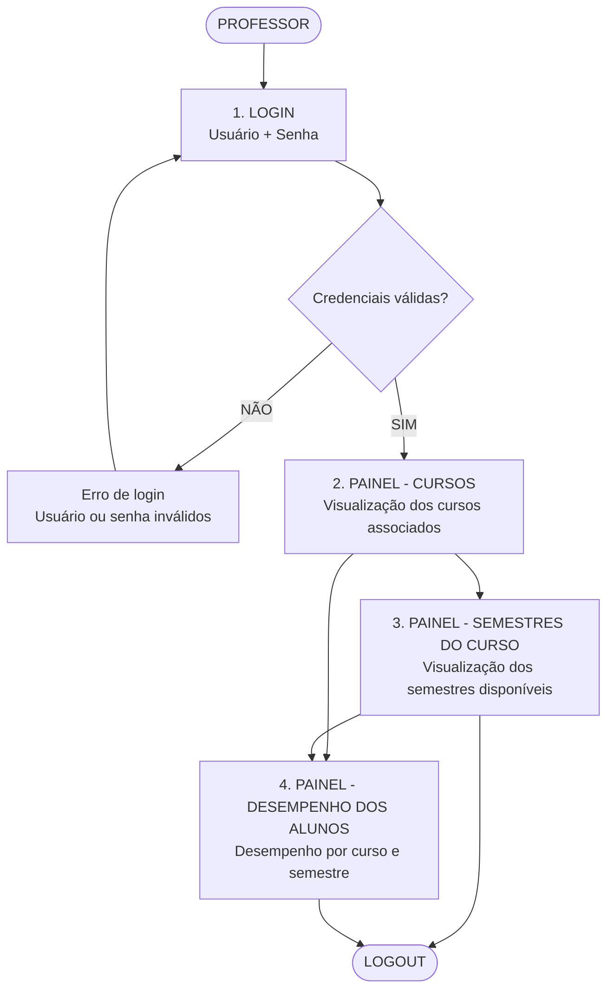
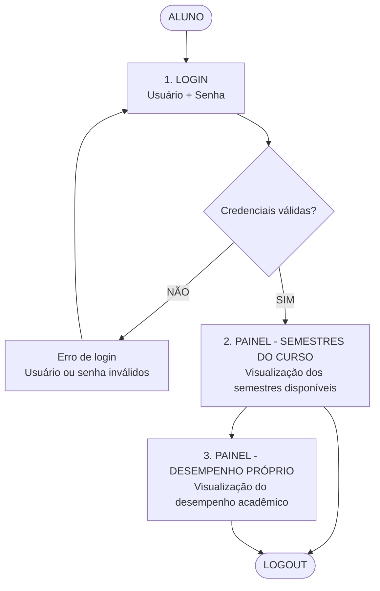

# Sistema Inteligente de Análise de Desempenho Escolar

## 1. Introdução

A transformação digital no ambiente educacional vem modificando significativamente a forma como escolas acompanham o desenvolvimento acadêmico dos alunos. Entretanto, muitas instituições ainda enfrentam dificuldades relacionadas à interpretação e utilização eficiente dos dados pedagógicos, limitando a capacidade de identificar problemas de aprendizagem de maneira precoce e estratégica.

Grande parte das escolas realiza o acompanhamento do desempenho estudantil apenas por meio de médias gerais, boletins e frequência escolar. Apesar de importantes, esses indicadores apresentam uma visão superficial do processo de aprendizagem, dificultando a identificação de dificuldades específicas dos alunos e atrasando intervenções pedagógicas mais assertivas.

Nesse contexto, a integração de softwares educacionais com ferramentas analíticas surge como uma alternativa relevante para modernizar a gestão pedagógica.

---

## 2. Problemática

O principal problema identificado na análise de desempenho escolar está relacionado à ausência de mecanismos inteligentes capazes de diagnosticar dificuldades específicas dos alunos em tempo hábil.

Atualmente, em muitos ambientes escolares:

- As notas são analisadas apenas de forma geral;
- Professores possuem dificuldade em acompanhar individualmente todos os alunos;
- Há excesso de processos manuais e pouca integração tecnológica;
- A identificação de defasagens ocorre tardiamente;
- Os responsáveis recebem informações limitadas sobre o aprendizado.

### Como consequência:

- O rendimento escolar diminui;
- O aluno não recebe suporte direcionado;
- A escola perde capacidade estratégica de intervenção.

Outro fator crítico é que os sistemas tradicionais normalmente apresentam apenas indicadores quantitativos simples, sem aprofundamento analítico. Assim, um aluno pode possuir média razoável, mas apresentar deficiência grave em conteúdos específicos que futuramente comprometerão seu desenvolvimento acadêmico.

---

# Fluxograma do Sistema

  
  

# Fluxograma — Professor

---

# Fluxograma — Aluno

