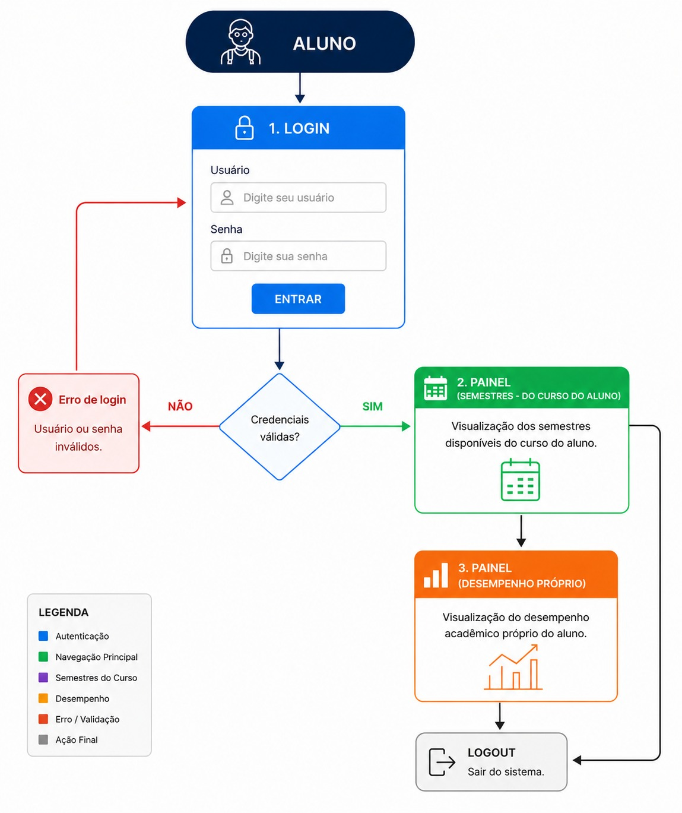
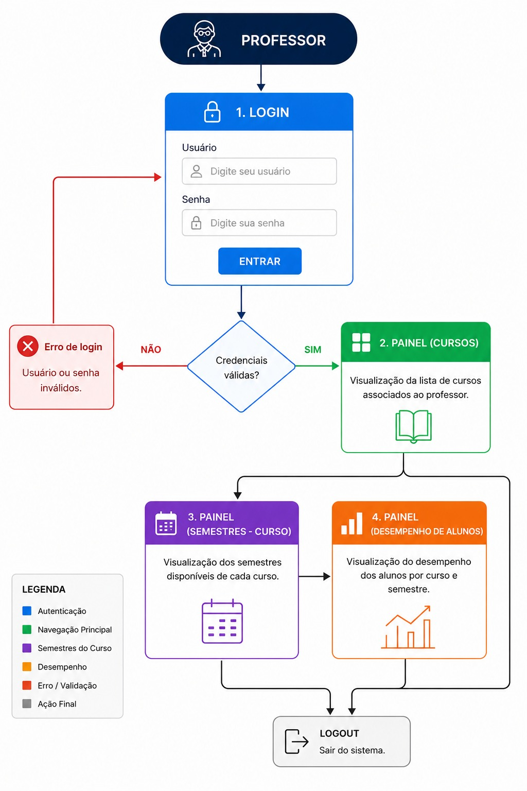

# Sistema Inteligente de Análise de Desempenho Escolar

## Identidade do Projeto

### NEWMOON • COONTEX

**PIES — Projeto de Integração Escola Software**

Sistema inteligente desenvolvido para modernizar a gestão pedagógica através da análise de dados educacionais, acompanhamento contínuo do desempenho dos alunos e identificação precoce de dificuldades de aprendizagem.

---

# 1. Introdução

A transformação digital na educação vem mudando a forma como as escolas acompanham o desempenho dos alunos. Porém, muitas instituições ainda possuem dificuldades para interpretar e utilizar dados pedagógicos de forma eficiente, dificultando a identificação precoce de problemas de aprendizagem.

Normalmente, o acompanhamento é feito apenas por médias, boletins e frequência escolar. Embora importantes, esses indicadores oferecem uma visão limitada do aprendizado, atrasando intervenções pedagógicas mais assertivas.

Nesse cenário, a integração de softwares educacionais com ferramentas analíticas surge como uma solução para modernizar a gestão pedagógica.

O **PIES (Projeto de Integração Escola Software)** foi desenvolvido com o objetivo de transformar dados escolares em informações estratégicas, permitindo que escolas, professores e responsáveis acompanhem o desenvolvimento dos alunos de forma mais precisa, inteligente e preventiva.

---

# 2. Problemática

O principal problema da análise de desempenho escolar é a falta de mecanismos inteligentes capazes de identificar dificuldades específicas dos alunos rapidamente.

Em muitas escolas:

- As notas são analisadas apenas de forma geral;
- Professores têm dificuldade em acompanhar todos os alunos individualmente;
- Existem muitos processos manuais e pouca integração tecnológica;
- A identificação das defasagens acontece tardiamente;
- Os responsáveis recebem poucas informações sobre o aprendizado.

## Como consequência:

- O rendimento escolar diminui;
- O aluno não recebe suporte adequado;
- A escola perde capacidade de intervenção estratégica.

Além disso, sistemas tradicionais apresentam apenas dados quantitativos simples, sem análises detalhadas. Assim, um aluno pode ter média razoável, mas apresentar dificuldades específicas que comprometem seu desenvolvimento futuro.

O PIES surge justamente para solucionar esse cenário, oferecendo análise inteligente, integração digital e acompanhamento contínuo da evolução pedagógica.

---

# 3. Objetivos do Projeto

## Objetivo Geral

Desenvolver um sistema inteligente capaz de auxiliar instituições de ensino no monitoramento do desempenho escolar, utilizando análise de dados para identificar dificuldades de aprendizagem e apoiar decisões pedagógicas estratégicas.

## Objetivos Específicos

- Centralizar dados pedagógicos em uma única plataforma;
- Automatizar processos de acompanhamento escolar;
- Gerar diagnósticos detalhados de desempenho;
- Identificar dificuldades específicas por conteúdo;
- Permitir acompanhamento em tempo real;
- Melhorar a comunicação entre escola e responsáveis;
- Oferecer dashboards visuais para análise pedagógica;
- Apoiar intervenções pedagógicas assertivas.

---

# 4. Benefícios do PIES

## Projeto de Integração Escola Software

O sistema transforma a gestão pedagógica e potencializa o desempenho individual de cada aluno através de tecnologia, análise de dados e automação inteligente.

---

## 360° — Visão Completa do Aluno

O PIES oferece uma visão ampla do desenvolvimento do estudante, indo além das médias gerais e permitindo análises mais profundas sobre aprendizagem, evolução e desempenho específico.

### Tags

- Visão Analítica
- Dados Integrados
- Monitoramento Completo

---

## Tempo Real

O sistema permite identificar dificuldades rapidamente, sem precisar aguardar o fechamento do período letivo.

Com isso, a escola consegue agir preventivamente antes que pequenas dificuldades se tornem grandes defasagens.

### Tags

- Diagnóstico Imediato
- Monitoramento Contínuo
- Intervenção Precoce

---

## 0 Papel

A digitalização elimina processos manuais e reduz significativamente o uso de documentos físicos.

Isso gera mais eficiência administrativa, organização e agilidade para toda a equipe pedagógica.

### Tags

- Sustentabilidade
- Automação
- Eficiência

---

## Dashboard de Evolução

Visualização clara e contínua do desempenho individual ao longo do tempo, permitindo identificar tendências antes que virem problemas críticos.

### Funcionalidades

- Evolução de notas;
- Comparativo por período;
- Indicadores de desempenho;
- Alertas pedagógicos;
- Histórico acadêmico.

### Tags

- Análise Temporal
- Dados em Painel
- Business Intelligence

---

## Diagnóstico Preciso

O sistema identifica dificuldades específicas por conteúdo, mesmo quando a média do aluno aparenta estar adequada.

Isso evita lacunas futuras no aprendizado.

### Exemplo

Um aluno pode possuir média satisfatória em matemática, mas apresentar dificuldade recorrente em geometria ou álgebra. O sistema detecta esse comportamento automaticamente.

### Tags

- Por Conteúdo
- Detecção Precoce
- Inteligência Analítica

---

## Intervenção Assertiva

Professores recebem sugestões e direcionamentos baseados em dados reais, permitindo ações mais eficientes e personalizadas.

### Benefícios

- Melhor direcionamento pedagógico;
- Acompanhamento individual;
- Redução de reprovações;
- Maior eficiência no reforço escolar.

### Tags

- Recomendações
- Personalização
- Apoio Pedagógico

---

## Transparência com Pais

Os responsáveis passam a receber informações mais detalhadas sobre o aprendizado dos alunos, superando o modelo tradicional baseado apenas em boletins.

### Recursos

- Relatórios detalhados;
- Acompanhamento de evolução;
- Alertas de desempenho;
- Comunicação mais clara entre escola e família.

### Tags

- Relatórios
- Engajamento Familiar
- Comunicação

---

## Menos Burocracia

O sistema reduz tarefas administrativas repetitivas, permitindo que os professores foquem no processo de ensino.

### Tags

- Automação
- Produtividade
- Eficiência Operacional

---

## Implantação Segura

A implementação ocorre de forma gradual e segura, garantindo adaptação da equipe pedagógica e continuidade operacional.

### Tags

- Segurança
- Suporte
- Integração Gradual

---

## Impacto Estratégico

O PIES transforma dados pedagógicos em decisões estratégicas.

A instituição ganha capacidade real de intervenção precoce, reduzindo defasagens e elevando o rendimento escolar com base em informações concretas.

### Resultados Esperados

- Redução da evasão escolar;
- Melhora no desempenho acadêmico;
- Aumento da eficiência pedagógica;
- Gestão baseada em dados;
- Maior previsibilidade educacional.

---

# 5. Fluxograma do Sistema

## Arquitetura e Fluxo Operacional

O sistema foi estruturado para integrar coleta de dados, processamento analítico e visualização pedagógica em um fluxo contínuo.

<p align="center">
  
</p>

<p align="center">
  
</p>

## Funcionamento Geral do Fluxo

1. Os dados escolares são coletados através da plataforma;
2. As informações são armazenadas e processadas;
3. O sistema realiza análises inteligentes de desempenho;
4. Dashboards e relatórios são gerados automaticamente;
5. Professores e gestores recebem diagnósticos pedagógicos;
6. Responsáveis acompanham a evolução do aluno;
7. A escola realiza intervenções mais rápidas e eficientes.

---

# 6. Recursos Tecnológicos

## Principais Recursos do Sistema

- Plataforma integrada de gestão pedagógica;
- Dashboards interativos;
- Análise inteligente de desempenho;
- Relatórios automatizados;
- Sistema de alertas;
- Monitoramento em tempo real;
- Interface intuitiva;
- Comunicação entre escola e responsáveis.

---

# 7. Conclusão

A implementação do PIES demonstra como a integração entre tecnologia e educação pode transformar a gestão pedagógica em um processo mais estratégico, eficiente e humanizado.

Por meio da análise inteligente de dados, dashboards de evolução e diagnósticos precisos, o sistema permite que escolas identifiquem dificuldades de aprendizagem de forma antecipada, oferecendo intervenções mais assertivas e personalizadas para cada aluno.

Além disso, a automação de processos reduz a burocracia escolar e fortalece a comunicação entre instituição, professores e responsáveis.

Entretanto, o sucesso dessa integração depende não apenas da tecnologia, mas também da adaptação da equipe pedagógica, do uso responsável dos dados e da implantação gradual do sistema.

O PIES não substitui o papel do educador, mas potencializa sua capacidade de tomada de decisão com base em informações concretas.

Dessa forma, o projeto se apresenta como uma solução realista e inovadora para elevar o desempenho escolar, reduzir defasagens e construir uma educação mais eficiente, preventiva e orientada por dados.


---

# 8. Demonstração Visual do Sistema

## Dashboard de Desempenho Acadêmico — Passo a Passo

Abaixo está o fluxo visual completo do sistema, demonstrando desde a tela inicial até a visualização detalhada dos dados pedagógicos dos alunos.

---

# 1. Página Inicial — Visão Geral

A tela inicial apresenta os cursos disponíveis e um resumo visual do desempenho acadêmico.

### Destaques

- Cards de cursos;
- Indicadores de desempenho;
- Evolução acadêmica;
- Quantidade de avaliações;
- Alertas pedagógicos.

<p align="center">
  
</p>

---

# 2. Aplicação de Filtros

O sistema permite refinar os dados exibidos através de filtros inteligentes.

### Campos disponíveis

| Campo | Função |
|---|---|
| Ano letivo | Filtra por período escolar |
| Escola | Filtra por unidade |
| Etapa de ensino | Segmenta o nível educacional |
| Professor(a) | Filtra turmas específicas |
| Situação da turma | Exibe condições pedagógicas |

<p align="center">
  
</p>

---

# 3. Barra Lateral (Menu)

A barra lateral fornece acesso rápido às principais funcionalidades da plataforma.

### Funcionalidades disponíveis

- Início;
- Turmas;
- Desempenho;
- Avaliações;
- Relatórios;
- Metas;
- Alertas;
- Calendário;
- Configurações.

<p align="center">
  
</p>

---

# 4. Navegação por Semestres

Ao selecionar um curso, o sistema apresenta os semestres disponíveis para acompanhamento detalhado.

Cada card contém:

- Desempenho geral;
- Evolução;
- Avaliações;
- Alertas;
- Indicadores pedagógicos.

<p align="center">
  
</p>

---

# 5. Tela Final — Dados do Semestre

Na visualização final, o professor pode acompanhar os dados individuais dos alunos pertencentes ao semestre selecionado.

### Informações disponíveis

| Indicador | Descrição |
|---|---|
| Frequência | Presença do aluno |
| Média Atual | Desempenho atual |
| Média Anterior | Comparativo evolutivo |
| Avaliações | Quantidade de avaliações |
| Alertas | Riscos pedagógicos |
| Status | Situação geral do aluno |

<p align="center">
  
</p>

---

# Fluxo Completo de Navegação

```text
Página Inicial
      ↓
Aplicação de Filtros
      ↓
Barra Lateral
      ↓
Seleção de Curso
      ↓
Navegação por Semestres
      ↓
Visualização Detalhada dos Alunos
```

---

# Considerações sobre a Interface

A interface do sistema foi projetada com foco em:

- Simplicidade operacional;
- Visualização clara de indicadores;
- Navegação intuitiva;
- Monitoramento em tempo real;
- Acompanhamento pedagógico contínuo;
- Tomada de decisão baseada em dados.

Além disso, os dashboards permitem identificação rápida de riscos pedagógicos, facilitando intervenções preventivas e acompanhamento individualizado dos estudantes.

